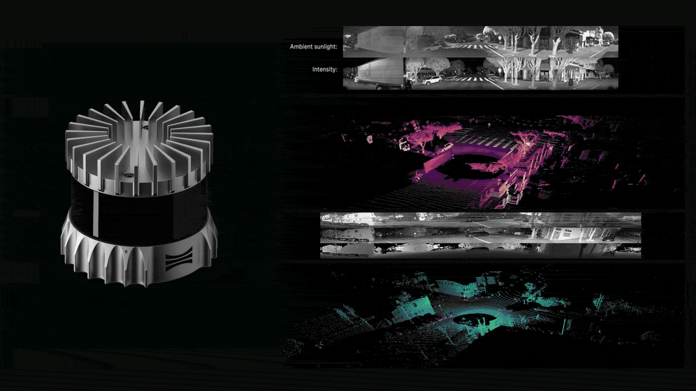

<!--
====================================================================
  COVER IMAGE PLACEHOLDER
  Drop your cover image here. Recommended size: 1600 x 500 px.
  Example:
  
====================================================================
-->

<p align="center">
  
</p>

<br/>

# Ouster LiDAR End-to-End Workflow
### Network Setup, Firmware Update, SDK Installation, PCAP Recording, Offline & Online SLAM, BIM-Ready Point Cloud Export, and Publication-Grade Rendering

A complete, beginner-friendly, step-by-step tutorial for working with **Ouster OS1 and OS0 LiDAR sensors** on **Ubuntu 22.04** using the **Ouster SDK**.

This guide covers the full pipeline — from connecting the sensor for the very first time to producing a publication-grade 3D point cloud rendering. It is designed to work transparently across multiple robotic platforms (e.g. **Clearpath Jackal**, **Boston Dynamics Spot**, or a standalone desktop) by relying on the sensor hostname rather than fragile static IP addresses.

> ⚠️ **This tutorial is not a replacement for Ouster's extensive official documentation.** It is a practical shortcut to help you get up and running quickly with a working end-to-end pipeline, without spending hours digging through manuals. For in-depth specifications, advanced configuration, firmware internals, and the full API reference, always refer to the [official Ouster documentation](https://static.ouster.dev/) linked at the end of this guide.

> Target use cases: robotics, indoor/outdoor mapping, digital twins, nuclear-environment surveys, and any workflow that needs a reliable offline LiDAR pipeline before — or instead of — moving to ROS 2.

---

## Table of Contents

1. [Tested Configuration](#tested-configuration)
2. [Workflow Overview](#workflow-overview)
3. [Step 1 — Connect to the Sensor (Network Setup)](#step-1--connect-to-the-sensor-network-setup)
4. [Step 2 — Update the Firmware](#step-2--update-the-firmware)
5. [Step 3 — Install the Ouster SDK](#step-3--install-the-ouster-sdk)
6. [Step 4 — Retrieve Sensor Metadata](#step-4--retrieve-sensor-metadata)
7. [Step 5 — Record a PCAP Dataset](#step-5--record-a-pcap-dataset)
8. [Step 6 — Run SLAM (Offline and Online)](#step-6--run-slam-offline-and-online)
9. [Step 7 — Visualize the Reconstructed Map](#step-7--visualize-the-reconstructed-map)
10. [Step 8 — Export a BIM-Ready Point Cloud](#step-8--export-a-bim-ready-point-cloud)
11. [Step 9 — Render the Point Cloud in CloudCompare (LIO-SAM Look)](#step-9--render-the-point-cloud-in-cloudcompare-lio-sam-look)
12. [Recommended Settings Summary](#recommended-settings-summary)
13. [Monitor System Resources](#monitor-system-resources)
14. [Project Structure](#project-structure)
15. [Official Resources](#official-resources)
16. [License](#license)

---

## Tested Configuration

### Sensors
- **Ouster OS1 — Rev6 / 64 channels**
- **Ouster OS0 — Rev7 / 128 channels**

### Host system
- **Ubuntu 22.04 LTS**
- **Python 3.8 – 3.13**
- **Ouster SDK 0.16.1**
- (Optional) **ROS 2 Humble** for downstream integration
- (Optional) **CloudCompare 2.13+** for publication-grade rendering

> Throughout this guide, replace `<SENSOR_HOSTNAME>` with the hostname of your sensor (see Step 1). Anywhere you see `os-XXXXXXXXXXXX.local`, substitute your own 12-digit serial number.

---

## Workflow Overview

```text
Network Setup → Firmware → SDK → Metadata → PCAP → SLAM → OSF → Visualization → PLY Export → CloudCompare Rendering
```

1. Connect to the sensor (IP vs. hostname)
2. Update the firmware
3. Install and verify the Ouster SDK
4. Retrieve sensor metadata
5. Record a `.pcap` dataset
6. Run SLAM (offline from PCAP or online from the live sensor)
7. Visualize the result in the Ouster viewer
8. Export a `.ply` point cloud for BIM / digital twin workflows
9. Render the cloud in CloudCompare with a LIO-SAM-style color ramp

---

## Step 1 — Connect to the Sensor (Network Setup)

The most common pitfall when moving a LiDAR between robots (for example a **Clearpath Jackal** on the `192.168.131.x` subnet vs. a **Boston Dynamics Spot** on the `192.168.50.x` subnet) is an IP address mismatch. This step explains how to avoid that problem entirely.

### 1.1 Default factory configuration (DHCP)

Out of the box, Ouster sensors **do not have a static IP address**. They are configured as **DHCP clients**:

- If connected to a DHCP server (a router, a Spot payload port, the Jackal internal switch…), they receive a dynamic IP.
- If connected **directly to a PC** without a DHCP server, they fall back to a **Link-Local** address in the `169.254.x.x` range.

### 1.2 The bulletproof method — use the sensor hostname

Ouster sensors continuously advertise their hostname on the local network via **mDNS** (Bonjour / Avahi). This means you can reach the sensor **by name**, no matter which subnet it landed on.

The hostname is always:

```text
os-<12_DIGIT_SERIAL_NUMBER>.local
```

> The 12-digit serial number is printed on a label on top of the sensor.

**Example (placeholder — replace with your own serial):**

```text
os-XXXXXXXXXXXX.local
```

**Test the connection from your Ubuntu PC:**

```bash
ping -4 os-XXXXXXXXXXXX.local
```

If the ping fails on a **direct point-to-point** connection, open your Ubuntu network settings and set the wired IPv4 configuration to **"Link-Local Only"** (instead of "Automatic (DHCP)"). Then replug the cable and retry.

> On Ubuntu, mDNS resolution requires `avahi-daemon`, which is installed and enabled by default on desktop images. If needed: `sudo apt install avahi-daemon libnss-mdns`.

### 1.3 Recommended strategy for multi-robot labs

**Do not set a static IP** if you frequently move the sensor between a Jackal, a Spot, and a desktop workstation. Keep the sensor in DHCP mode and **always use the hostname** in your commands and launch files. Your ROS 2 and `ouster-cli` workflows will then work on every platform without modification.

### 1.4 Open the sensor web interface

Once the ping succeeds, open a browser and navigate to:

```text
http://os-XXXXXXXXXXXX.local
```

You will land on Ouster's built-in dashboard showing firmware version, temperature, network configuration, and a live preview.

---

## Step 2 — Update the Firmware

Before collecting data, verify that the sensor is running the correct firmware family for its hardware revision.

### 2.1 Check the current firmware version

From the web interface (Step 1.4), the firmware version is shown on the dashboard. From the terminal:

```bash
curl "http://os-XXXXXXXXXXXX.local/api/v1/system/firmware" | python3 -m json.tool
```

### 2.2 Recommended firmware families

| Sensor | Hardware revision | Recommended firmware family |
|--------|-------------------|-----------------------------|
| OS1    | Rev6              | 2.x                         |
| OS1    | Rev7              | 3.x                         |
| OS0    | Rev7              | 3.x                         |

> **Important:** never mix Rev6 and Rev7 firmware families — each hardware revision has its own firmware lineage.

### 2.3 Download the firmware

Download the correct firmware package from the official Ouster downloads page:
[https://ouster.com/downloads](https://ouster.com/downloads)

### 2.4 Update via the web interface (recommended method)

This is the **official, supported** way to flash an Ouster sensor:

1. Open `http://os-XXXXXXXXXXXX.local`
2. Go to **Settings**
3. Open **Firmware Update**
4. Upload the `.img` file you downloaded
5. Wait for the sensor to reboot (≈ 1–2 minutes)
6. Refresh the page and confirm the new version

> ⚠️ **Do not power-cycle the sensor during the update.** A failed flash can leave the device in recovery mode.

Compatibility note: as of Ouster SDK 0.13.0 and later, the SDK is no longer compatible with firmware versions older than **2.1.0**. Official support for firmware 2.2 and 2.3 ended in June 2025.

---

## Step 3 — Install the Ouster SDK

The recommended installation uses a dedicated Python virtual environment.

### 3.1 Create a working directory and a virtual environment

```bash
mkdir -p ~/ouster_project
cd ~/ouster_project

python3 -m venv .venv
source .venv/bin/activate
```

### 3.2 Upgrade pip and install the SDK

```bash
python3 -m pip install --upgrade pip setuptools
python3 -m pip install "ouster-sdk[examples]"
```

### 3.3 Verify the installation

```bash
python3 -m pip show ouster-sdk
python3 -m pip list | grep ouster
ouster-cli --help
```

You should see Ouster SDK `0.16.1` (or newer) and a working `ouster-cli` entry point.

> Requirements: Python **3.8 – 3.13**, pip **≥ 19.0**, and `glibc ≥ 2.28` on Linux.

---

## Step 4 — Retrieve Sensor Metadata

The sensor metadata JSON file is **required** when replaying a PCAP offline. It describes the beam angles, lidar mode, UDP profile, intrinsic calibration, etc.

### 4.1 Download the metadata

```bash
curl "http://os-XXXXXXXXXXXX.local/api/v1/sensor/metadata" -o sensor_metadata.json
```

### 4.2 Inspect the metadata

```bash
cat sensor_metadata.json | python3 -m json.tool | head -40
```

Or open it directly in a browser:

```text
http://os-XXXXXXXXXXXX.local/api/v1/sensor/metadata
```

---

## Step 5 — Record a PCAP Dataset

Use `ouster-cli` to record raw packets from the live sensor. Note that we use the **hostname** — not a fragile IP address.

### 5.1 Start a recording

```bash
ouster-cli source os-XXXXXXXXXXXX.local record capture.pcap
```

This produces two files in the current directory:

- `capture.pcap` — raw LiDAR + IMU packet stream
- `capture.json` — sensor metadata required for offline playback

Press **Ctrl+C** to stop the recording.

### 5.2 Practical recommendations

- Move the robot **slowly and smoothly** during acquisition — avoid sharp yaws.
- Prefer trajectories with **clear loop overlap** for better SLAM convergence.
- Use **Gigabit Ethernet**, especially for the OS0-128 (higher packet rate).
- Monitor CPU, RAM, and disk I/O during recording (see [Section 13](#monitor-system-resources)).

---

## Step 6 — Run SLAM (Offline and Online)

The `ouster-cli ... slam` command uses the built-in **KISS-ICP** algorithm to estimate the sensor trajectory and fuse the point clouds into a globally consistent map.

Two input sources are supported:

| Mode    | Source                         | Typical use case                           |
|---------|--------------------------------|--------------------------------------------|
| Offline | `capture.pcap` (+ metadata)    | Post-processing a recorded dataset         |
| Online  | `os-XXXXXXXXXXXX.local` (live) | Real-time preview during data acquisition  |

### 6.1 Parameter overview

The full pipeline involves three families of parameters that operate at **different stages** of the processing chain. Understanding which parameter applies where is key to producing clean, reproducible results.

| Parameter                          | Stage         | Purpose                                                                                  |
|------------------------------------|---------------|------------------------------------------------------------------------------------------|
| `--voxel-size`                     | SLAM engine   | Controls map resolution and computational load (see table below)                         |
| `--min-range` / `--max-range`      | SLAM engine   | Restrict the range used for ICP matching — flags of the `slam` sub-command               |
| `filter RANGE <min>m:<max>m`       | Post-SLAM     | Remove points outside a range window from the **output** scans (cleans the saved cloud)  |
| `filter REFLECTIVITY 1:1`          | Post-SLAM     | Drop the lowest-reflectivity points (typically noise on glass and dark surfaces)         |

> 💡 **Two distinct mechanisms — do not confuse them.**
> - `--min-range` / `--max-range` (flags of `slam`) tell the **SLAM engine** which points to *use for matching*. They protect ICP from noisy near-field returns and from far-range echoes that don't help registration.
> - `filter RANGE` and `filter REFLECTIVITY` (separate sub-commands) tell the **pipeline** which points to *write out* in the saved/visualized cloud. They are applied **after** SLAM and do not affect pose estimation.
>
> Using both together is the recommended pattern for crisp maps: keep the SLAM engine well-fed with relevant returns, and clean the final cloud before saving or exporting.

**Voxel-size rules of thumb** (from Ouster's official guidance):

- **Outdoor:** `1.4 – 2.2`
- **Large indoor:** `1.0 – 1.8`
- **Small indoor:** `0.4 – 0.8`
- **Best possible detail** (cost: more CPU/RAM): `0.25 – 0.5`

> Since SDK 0.16, `ouster-cli` can **auto-calculate** the voxel size if you omit `--voxel-size`. It is often a good starting point; set a manual value only when you need tighter control.

---

### 6.2 Offline SLAM — OS1-64 (Rev6)

**Indoor mapping:**

```bash
ouster-cli source capture.pcap slam \
  --voxel-size 0.25 \
  --min-range 1.0 --max-range 30.0 \
  filter REFLECTIVITY 1:1 \
  save map_os1_indoor.osf
```

**Outdoor mapping:**

```bash
ouster-cli source capture.pcap slam \
  --voxel-size 0.8 \
  --min-range 1.0 --max-range 100.0 \
  filter REFLECTIVITY 1:1 \
  save map_os1_outdoor.osf
```

---

### 6.3 Offline SLAM — OS0-128 (Rev7)

**Indoor mapping:**

```bash
ouster-cli source capture.pcap slam \
  --voxel-size 0.30 \
  --min-range 1.0 --max-range 50.0 \
  filter REFLECTIVITY 1:1 \
  save map_os0_indoor.osf
```

**Outdoor mapping:**

```bash
ouster-cli source capture.pcap slam \
  --voxel-size 1.0 \
  --min-range 1.0 --max-range 50.0 \
  filter REFLECTIVITY 1:1 \
  save map_os0_outdoor.osf
```

> 💡 **Why `--min-range 1.0`?** Ouster's official guidance recommends discarding points closer than 1 m: bi-static LiDARs lose precision below this distance, and near-field returns from cables, mounts, or the robot chassis pollute the ICP matcher. The benefit is most visible on the OS0-128 where the dense return pattern is especially prone to self-detection.
>
> 💡 **Why `--max-range 50` indoor (and not 30)?** In confined indoor environments the instinct is to clip the range short, but KISS-ICP needs **distant geometric constraints** to disambiguate rotation and to lock onto consistent structure across symmetric corridors. Open doors, long hallways, and adjacent rooms all contribute valuable matching cues that a 20–30 m clip would discard. The CPU cost of going from 30 m to 50 m is negligible.

---

### 6.4 Replay a PCAP with an explicit metadata file

If the metadata JSON was not generated automatically, pass it with `--meta`:

```bash
ouster-cli source --meta sensor_metadata.json capture.pcap slam \
  --voxel-size 0.25 \
  --min-range 1.0 --max-range 50.0 \
  filter REFLECTIVITY 1:1 \
  save map.osf
```

---

### 6.5 The complete pipeline — production example

Below is a real-world, production-grade pipeline for the OS0-128 in a confined indoor environment (validated with SDK 0.16.1). It runs **three stages in a single command**: SLAM, point-cloud cleaning, and high-quality visualization, while saving the result for downstream use.

This is presented in **two equivalent forms**:

1. **All-in-one** — convenient for single-shot processing.
2. **Three separate commands** — recommended for development, debugging, and re-running individual stages without recomputing the SLAM.

---

#### 6.5.1 Form A — All-in-one pipeline

```bash
ouster-cli source --meta LowerWalk.json LowerWalk.pcap \
  slam --voxel-size 0.25 --min-range 1.0 --max-range 50.0 \
  filter RANGE 0m:1m \
  filter REFLECTIVITY 1:1 \
  viz --accum-num 0 --accum-every-m 0.5 \
       --map --map-ratio 1.0 --map-size 50000000 \
       -e stop \
  save LowerWalk.osf
```

**What each segment does:**

| Stage              | Command segment                                                                                              | Role                                                                  |
|--------------------|--------------------------------------------------------------------------------------------------------------|-----------------------------------------------------------------------|
| 1 — SLAM           | `slam --voxel-size 0.25 --min-range 1.0 --max-range 50.0`                                                    | Run KISS-ICP on the raw scans, estimate poses                         |
| 2 — Cleaning       | `filter RANGE 0m:1m` and `filter REFLECTIVITY 1:1`                                                           | Drop near-field noise and lowest-reflectivity points from the output  |
| 3 — Visualization  | `viz --accum-num 0 --accum-every-m 0.5 --map --map-ratio 1.0 --map-size 50000000 -e stop`                    | Display the full map at maximum density (see notes below)             |
| Persistence        | `save LowerWalk.osf`                                                                                         | Write the cleaned scans + poses to an OSF for later reuse             |

> ⚠️ **Resource warning.** `--map-ratio 1.0` and `--map-size 50000000` together can consume **1.5–2 GB of RAM** on long indoor walks. If your workstation struggles, scale down to `--map-ratio 0.3 --map-size 15000000` (~500 MB) — the visual difference is minor and the result is still publication-grade.

---

#### 6.5.2 Form B — Pipeline broken down into three stages

This decomposition is the **recommended workflow** during development. Each stage produces a distinct, reusable artifact, so you can iterate on cleaning or visualization without re-running the (expensive) SLAM step.

##### Stage 1 — Run SLAM and persist the raw OSF

```bash
ouster-cli source --meta LowerWalk.json LowerWalk.pcap \
  slam --voxel-size 0.25 --min-range 1.0 --max-range 50.0 \
  save LowerWalk_raw.osf
```

**Output:** `LowerWalk_raw.osf` — full SLAM result with trajectory and unfiltered scans. This is your **archival ground truth**: keep it untouched and apply all downstream operations to copies.

---

##### Stage 2 — Clean the point cloud

```bash
ouster-cli source LowerWalk_raw.osf \
  filter RANGE 0m:1m \
  filter REFLECTIVITY 1:1 \
  save LowerWalk_clean.osf
```

**Output:** `LowerWalk_clean.osf` — same trajectory, cleaned cloud (no points below 1 m, no `reflectivity=1` points). Use this file for visualization, analysis, and PLY export.

> 💡 You can experiment with different filter thresholds (e.g. `filter RANGE 0m:2m` for a stricter near-field cut) without ever touching the SLAM step again.

---

##### Stage 3 — Visualize at maximum quality

```bash
ouster-cli source LowerWalk_clean.osf viz \
  --accum-num 0 \
  --accum-every-m 0.5 \
  --map --map-ratio 1.0 --map-size 50000000 \
  -e stop
```

**What you get:** the full reconstructed map, no sliding-window erasure, every point of every scan rendered into a persistent overlay.

| Visualization parameter | Effect                                                                                            |
|-------------------------|---------------------------------------------------------------------------------------------------|
| `--accum-num 0`         | Unlimited scan accumulator — **nothing fades out** as the playback progresses                     |
| `--accum-every-m 0.5`   | Adds a dense keyframe every 0.5 m of travel (good density for confined indoor walks)              |
| `--map`                 | Enables the persistent overall map (random sample of every scan, kept for the entire session)     |
| `--map-ratio 1.0`       | Send 100% of each scan's points to the persistent map (max density)                               |
| `--map-size 50000000`   | Raise the overall map cap to 50 M points (default is 1.5 M — far too small for full walks)        |
| `-e stop`               | Stop the viewer cleanly at end of file (no looping, no manual Ctrl+C needed)                      |

##### Inside the viewer — keyboard shortcuts worth knowing

The default Ouster palette is purple/orange (calibrated reflectivity), which can be hard to read. While the viewer is running:

| Key   | Action                                                                                              |
|-------|-----------------------------------------------------------------------------------------------------|
| `m`   | Cycle the **coloring source** (range / signal / reflectivity / near-IR)                             |
| `c`   | Cycle the **palette** of the accumulated cloud (Greyscale, Viridis, Spezia, Calibrated, etc.)       |
| `6`   | Toggle the SCAN accumulator overlay                                                                 |
| `7`   | Toggle the MAP overlay                                                                              |
| `8`   | Toggle the trajectory line                                                                          |
| `o` / `p` | Increase / decrease point size                                                                  |

For a "rainbow" look similar to LIO-SAM in RViz (blue → green → yellow → orange → red), press `c` until you reach the **Spezia** or **Calibrated** palette.

---

### 6.6 Online SLAM (live sensor)

You can also run SLAM **directly on the live stream** — useful for quick field checks:

```bash
ouster-cli source os-XXXXXXXXXXXX.local slam viz --accum-num 100
```

Add filters and saving just like the offline case:

```bash
ouster-cli source os-XXXXXXXXXXXX.local slam \
  --voxel-size 0.25 \
  --min-range 1.0 --max-range 50.0 \
  filter REFLECTIVITY 1:1 \
  viz --accum-num 100 \
  save live_map.osf
```

Press **Ctrl+C** (or close the viewer) to stop.

> ⚠️ Heavy visualization options (`--map-ratio 1.0`, `--accum-num 0`) are **not recommended** in online mode — they compete with the SLAM engine for CPU and may drop packets. Keep online sessions lean and reserve maximum-quality rendering for offline replay.

---

## Step 7 — Visualize the Reconstructed Map

There are two visualization profiles, depending on what you need.

### 7.1 Quick preview — validate the trajectory

A light, GPU-friendly preview to confirm that the SLAM converged and the map looks coherent:

```bash
ouster-cli source map_os0_indoor.osf viz \
  --accum-num 20 \
  --accum-every-m 2.0 \
  --map \
  -e stop
```

**Why this configuration:**

- `--accum-num 20` — 20 dense keyframes in a sliding window (cheap on the GPU)
- `--accum-every-m 2.0` — one keyframe every 2 m of travel
- `--map` — keeps a persistent map overlay so the global structure stays visible
- `-e stop` — exits cleanly at end of file

This profile is fast to launch and well-suited to checking dozens of recordings in succession.

### 7.2 Maximum quality — final inspection and screenshots

When you need the densest possible rendering for inspection, screenshots, or stakeholder demos:

```bash
ouster-cli source map_os0_indoor.osf viz \
  --accum-num 0 \
  --accum-every-m 0.5 \
  --map --map-ratio 1.0 --map-size 50000000 \
  -e stop
```

This is the same configuration as Stage 3 of the production pipeline (Section 6.5.2). Expect 1.5–2 GB of RAM on long indoor walks.

> 💡 **Tip — palettes for crisp visuals.** Inside the viewer, press `c` to cycle palettes. **Spezia** and **Calibrated** give a familiar blue→green→yellow→red gradient that resembles LIO-SAM/RViz output and is generally easier to read than the default purple.

---

## Step 8 — Export a BIM-Ready Point Cloud

Once the SLAM result is validated, export the cleaned map as a `.ply` point cloud. The `save` command automatically detects the output format from the file extension.

### 8.1 Standard export (recommended)

If you followed the three-stage workflow in Section 6.5.2, your `LowerWalk_clean.osf` already contains the filtered point cloud. **Do not re-apply the filters** — they would only add CPU overhead without changing the result:

```bash
ouster-cli source LowerWalk_clean.osf save final_map.ply
```

### 8.2 Export with cleaning applied on the fly

If you only have the raw OSF (no cleaning step performed yet), apply the filters during export:

```bash
ouster-cli source LowerWalk_raw.osf \
  filter RANGE 0m:1m \
  filter REFLECTIVITY 1:1 \
  save final_map.ply
```

### 8.3 Export with a tighter range window

To restrict the export to a useful range window (for example, drop everything beyond 50 m for a focused indoor scene), use the `clip` command:

```bash
ouster-cli source LowerWalk_clean.osf \
  clip RANGE,RANGE2 1m:50m \
  save final_map_clipped.ply
```

### 8.4 What's inside the PLY

The exported PLY contains per-point geometry plus several scalar attributes that CloudCompare and other tools can use for coloring:

| Attribute      | Description                                                                  |
|----------------|------------------------------------------------------------------------------|
| `x, y, z`      | 3D position in the SLAM world frame (metres)                                 |
| `intensity`    | Raw signal intensity                                                         |
| `reflectivity` | Calibrated reflectivity (0–255)                                              |
| `range`        | Distance from the sensor at the time of capture                              |

> 💡 No RGB colors are written to the PLY — colors are computed downstream from one of the scalar fields. See [Step 9](#step-9--render-the-point-cloud-in-cloudcompare-lio-sam-look) for the full rendering recipe.

The resulting file can be opened or post-processed in:

- **CloudCompare** — measurement, segmentation, registration, EDL rendering (covered in Step 9)
- **Open3D** — Python-based processing and meshing
- **MeshLab** — cleaning, decimation, surface reconstruction
- **Blender** — artistic rendering and animation
- Any BIM / digital twin pipeline (Revit, Navisworks, Autodesk ReCap, etc.)

---

## Step 9 — Render the Point Cloud in CloudCompare (LIO-SAM Look)

The PLY produced in Step 8 contains raw geometry and per-point attributes — but **no RGB colors**. CloudCompare must generate the coloring locally from one of the scalar fields. This step shows how to obtain the **blue → green → yellow → orange → red** rendering familiar from LIO-SAM and most SLAM publications, suitable for reports and presentations.

### 9.1 Install CloudCompare

```bash
sudo snap install cloudcompare
```

Or, for the latest stable release, download the AppImage from [https://www.cloudcompare.org/release/](https://www.cloudcompare.org/release/).

### 9.2 Choose the right scalar field for your rendering goal

| Goal                                          | Scalar field      | Resulting look                                       |
|-----------------------------------------------|-------------------|------------------------------------------------------|
| **LIO-SAM / RViz "rainbow" look**             | `Coord. Z`        | Floor blue, walls green/yellow, ceiling orange/red   |
| **Reflectivity emphasis** (signage, markings) | `reflectivity`    | Bright = reflective surfaces (signs, retroreflectors)|
| **Intensity** (classic LiDAR look)            | `intensity`       | Surface brightness, similar to grayscale photography |
| **Range from sensor**                         | `range`           | Distance gradient from trajectory                    |

For comparing your map against a LIO-SAM map, **always use `Coord. Z`** — that is the field LIO-SAM colors by default in RViz.

### 9.3 Open the PLY and apply the rainbow palette

1. **Open the file**: `File → Open → final_map.ply`
2. **Select the cloud** in the DB Tree (left panel) by clicking on it
3. **Activate the Z scalar field**:
   - In the Properties panel (bottom-left), find **Scalar Fields**
   - Click **Add scalar field from coordinate**, then choose **Z**
   - Set the new field as **active** (radio button next to its name)
4. **Apply the rainbow color ramp**:
   - Properties panel → **Color Scale** dropdown
   - Choose **Blue > Green > Yellow > Red** (this is the LIO-SAM/RViz default)
   - Alternatives that work well: **Viridis**, **High contrast**, **Rainbow**
5. **Adjust the value range** (optional but recommended):
   - Click the small **edit button** next to the scalar field name
   - Set min/max manually to match your scene height (e.g. 0.0 to 3.0 for a typical indoor walk)
   - This prevents outlier points (high ceiling fixtures, ground noise) from compressing the gradient

### 9.4 Activate Eye Dome Lighting (EDL) — the secret to a 3D look

Without EDL, point clouds look flat. EDL adds shading at depth discontinuities, producing the crisp 3D effect seen in professional surveying software.

- Top toolbar → **Display → Shaders & Filters → EDL Shader**
- Or keyboard shortcut: **Shift + L**

EDL works on top of any color ramp and is what makes the difference between a "nice screenshot" and a "publication-grade screenshot".

### 9.5 Quick rendering tweaks

| Adjustment            | Where                                                    | Recommended value                                            |
|-----------------------|----------------------------------------------------------|--------------------------------------------------------------|
| Point size            | Properties → **Point size**                              | 2–3 (1 looks too sparse)                                     |
| Background color      | **Display → Display settings → Colors → Background**     | White or very dark grey                                      |
| Camera projection     | Top toolbar → **Orthographic / Perspective** toggle      | Orthographic for top-down maps, perspective for walkthroughs |
| Light direction       | **Display → Light & materials**                          | Default is fine with EDL on                                  |

### 9.6 Export a publication-ready screenshot

1. Position the camera (rotate, pan, zoom) to frame the area of interest
2. **File → Save viewport as image**
3. Choose:
   - **Resolution**: 3840 × 2160 (4K) for deliverables, 1920 × 1080 for slides
   - **Zoom factor**: 2× or 3× for crisp anti-aliasing
   - Format: **PNG** (lossless, best for documents)

### 9.7 Compare your Ouster map against a LIO-SAM map

To compare your Ouster KISS-ICP map against a LIO-SAM map of the same scene:

1. Load both PLY files in the same CloudCompare session
2. Apply identical settings to both: same scalar field (`Coord. Z`), same color ramp (Blue > Green > Yellow > Red), same min/max range, EDL on
3. Use **Tools → Registration → Align (point pairs picking)** if the two maps are in different coordinate frames
4. For quantitative comparison: **Tools → Distances → Cloud/cloud distance** computes per-point error against a reference cloud, with a built-in colored histogram

> 💡 **Tip — keep colors consistent across screenshots.** When generating a series of screenshots for a report, save the CloudCompare session (`File → Save session`) so the exact color ramp, EDL settings, and camera position can be reloaded. This guarantees visual consistency across your figures.

### 9.8 Optional — automated rendering from the command line

For batch processing (multiple PLY files, identical rendering), CloudCompare exposes a non-interactive command-line interface. A minimal example to apply the Z-height rainbow ramp and export a PNG without opening the GUI:

```bash
CloudCompare -SILENT \
  -O final_map.ply \
  -SF_GRADIENT BGYR 0.0 3.0 \
  -SS PNG -RENDER_TO_FILE screenshot.png 1920 1080
```

Refer to the [CloudCompare command-line documentation](https://www.cloudcompare.org/doc/wiki/index.php?title=Command_line_mode) for the full flag reference.

---

## Recommended Settings Summary

| Sensor   | Environment | Voxel size | `--min-range` | `--max-range` | Expected result                        |
|----------|-------------|------------|---------------|---------------|----------------------------------------|
| OS1-64   | Indoor      | 0.25       | 1.0 m         | 30 m          | High-detail mapping                    |
| OS1-64   | Outdoor     | 0.80       | 1.0 m         | 100 m         | Stable large-scale mapping             |
| OS0-128  | Indoor      | 0.30       | 1.0 m         | 50 m          | Dense indoor reconstruction            |
| OS0-128  | Outdoor     | 1.00       | 1.0 m         | 50 m          | Efficient short-range outdoor mapping  |

> The `--min-range 1.0` baseline reflects Ouster's official guidance for bi-static LiDARs. The OS0-128 indoor `--max-range` is set to 50 m (rather than the OS1-64's 30 m) because the OS0's wider vertical FoV captures more useful long-range structure in indoor multi-room layouts.

---

## Monitor System Resources

SLAM and high-density visualization can be computationally heavy, especially with dense OS0-128 datasets.

```bash
btop
# or
htop
```

Watch closely:

- **RAM usage** — heavy `--map-ratio` settings can push past 2 GB
- **Swap usage** — should remain near zero; growing swap means you need a larger voxel or smaller map
- **CPU saturation** — sustained 100% on a single core indicates KISS-ICP is the bottleneck
- **Disk throughput** — relevant during recording and OSF writing

> If swap usage starts growing significantly, stop the process (**Ctrl+C**) and rerun with a **larger `--voxel-size`**, a smaller `--map-ratio`, or a tighter `--max-range`.

---

## Project Structure

A suggested layout for a clean working directory:

```text
ouster_project/
├── .venv/
├── captures/
│   ├── capture.pcap
│   └── capture.json
├── maps/
│   ├── LowerWalk_raw.osf
│   ├── LowerWalk_clean.osf
│   └── map_os0_outdoor.osf
├── exports/
│   └── final_map.ply
└── renders/
    └── final_map_4k.png
```

---

## Output Files

| Extension | Description                                        |
|-----------|----------------------------------------------------|
| `.pcap`   | Raw LiDAR packet capture                           |
| `.json`   | Sensor metadata                                    |
| `.osf`    | SLAM result with trajectory and fused point cloud  |
| `.ply`    | Exported point cloud for BIM / post-processing     |
| `.png`    | Publication-ready screenshot from CloudCompare     |

---

## Official Resources

- [Ouster Downloads](https://ouster.com/downloads)
- [Ouster SDK Documentation](https://static.ouster.dev/sdk-docs/)
- [Ouster Sensor Documentation](https://static.ouster.dev/sensor-docs/)
- [Ouster HTTP API Reference](https://static.ouster.dev/sensor-docs/image_route1/image_route2/common_sections/API/http-api-v1.html)
- [Ouster Community Forum](https://community.ouster.com/)
- [Optimal Sensor and SLAM Configuration for "Crisp" Mapping — Ouster Blog](https://ouster.com/insights/blog/sensor-config-for-crisp-mapping)
- [CloudCompare Documentation](https://www.cloudcompare.org/doc/wiki/index.php)
- [CloudCompare Command-Line Mode](https://www.cloudcompare.org/doc/wiki/index.php?title=Command_line_mode)

---

## License

This tutorial is provided as a technical reference for robotics, mapping, and digital twin workflows using Ouster LiDAR sensors and the Ouster SDK. Feel free to adapt it to your own projects — attribution appreciated.
